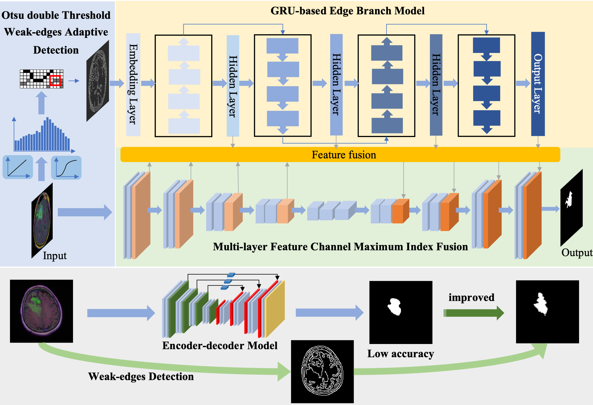

# Automatic Brain MRI Tumors Segmentation based on Deep Fusion of Weak Edge and Context Features

## Overview

<div style="text-align:center">
</div>

This code is mainly used for brain MRI tumor segmentation

In the data folder, you can follow the URL to download the data.
In the images folder, there are two kinds of images, the original image and the segmentation result.
There are two 'py' files in the model folder, which represent the edge recognition and segmentation model algorithms respectively.
Results are the evaluation results of each index.
The utils folder contains the relevant configuration files.
weights has the trained weights file, which can be downloaded through the link.
You can train by train.py and test the segmentation effect by test.py and predict.py.
You can use Otsu_Canny.py to segment brain MRI images and observe the edge recognition effect.

# Construction

    git clone https://github.com/DL-Clas/Tumors_Clas.git

## Testing with AS-WEC

Copy and paste your images into data/ or data2/ folder, and:

    python predict.py

## Contributions
    ● We proposed Otsu Double threshold Weak-edges adaptive Detection (Otsu-WD). We twice adopt Otsu threshold segmentation method to calculate the gradient threshold of lesion edges, and formulate weak edge detection rules to realize adaptive recognition of lesion edges and other detailed features.

    ● We constructed GRU-based Edge Branch model (GRU-EB). We construct a dual-branch network structure based on GRU and deep CNN, and guarantee the effective transmission of tumor edge context information through forward propagation.

    ● We designed Multi-layer Feature channel Max-index fusion mechanism (MF-Max). We fuse the encoder, decoder and edge feature maps according to the index position, fully balancing the details and context information to avoid key features being obliterated.

## Testing with AS-WEC

    python test.py
    
## Training with AS-WEC
    
    python train.py

Check the configurations of the training in train.py


## Brain MRI segmentation (LGG)

Here the [link](https://www.kaggle.com/datasets/mateuszbuda/lgg-mri-segmentation)

## Citation

```
Brain MRI segmentation [WWW Document], n.d. URL. https://www.kaggle.com/datasets/mateuszbuda/lgg-mri-segmentation
```

## BRATS 2019

Here the [link](http://www.braintumorsegmentation.org/)

## Citation

```
B. H. Menze, A. Jakab, S. Bauer, J. Kalpathy-Cramer, et al. The multimodal brain tumor image segmentation benchmark (BRATS) [J].
IEEE Transactions on Medical Imaging, 2015, 34(10), 1993-2024.https://doi.org/10.1109/TMI.2014.2377694.
```
